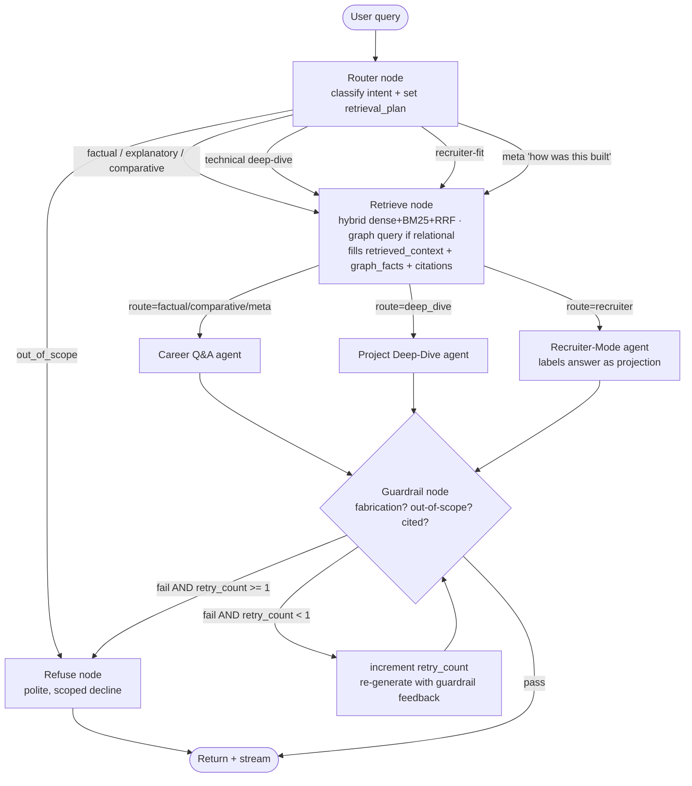

# AI Avatar — Personal RAG + Agent System
### Project Specification & Build Roadmap
**Owner:** Aniket Gaudgaul | **Purpose:** Portfolio centerpiece + skill-gap closure (Evals, MLOps, Cloud Deployment)

> **Revision note (v2):** LLM stack moved to **Gemini** for generation and judging; embeddings moved to **Gemini Embedding 2** (natively multimodal, single unified space) truncated to **1536 dimensions**. Ingestion, graph-construction, chunking, and metadata design added in Section 5. LangGraph state machine detailed in Section 7. Graph-construction review is **manual-approve** for v1.

---

## 1. Project Overview

### 1.1 What this is
A conversational AI system embedded in Aniket's portfolio website that lets visitors (recruiters, hiring managers, peers) ask natural-language questions about his career, projects, and expertise, and receive grounded, cited answers — as if talking to a well-briefed representative of Aniket, not Aniket himself.

Underneath the "avatar" framing, this is a **hybrid retrieval system** combining:
- A **knowledge graph** (structured facts: roles, companies, projects, skills, relationships)
- A **document store** (narrative content: resume prose, the ECIR paper, project write-ups, architecture docs)
- A **multimodal store** (diagrams, slides, screenshots) — sharing one embedding space with the text store
- A **light multi-agent layer** (routing + specialized response behavior)

### 1.2 Why this project (strategic rationale)
This single project is designed to close the majority of the production-infrastructure and evaluation gaps identified in Aniket's interview-readiness audit, while also serving as a real, always-on, publicly usable artifact — not a throwaway demo.

| Gap area | How this project closes it |
|---|---|
| RAG & Retrieval | Already a strength — this project extends it (multimodal, graph fusion) |
| Agents | Router + 2–3 specialist agents = real orchestration, not decoration |
| Evaluation | Self-authored ground-truth set (Aniket knows his own career best) |
| MLOps/Deployment | Docker → CI/CD → cloud deploy → monitoring, on a real service |
| Safety/Guardrails | Deliberately scoped refusal behavior (compensation, personal life, speculation) |

### 1.3 Non-goals (explicitly out of scope for v1)
- Full autobiographical chat (this is a career assistant, not a general chatbot)
- Fine-tuning a custom model (prompt + retrieval is sufficient and more defensible)
- Real-time data (LinkedIn scraping, live job status) — content is curated and versioned
- Voice I/O in v1 (planned as a Tier 4 stretch goal, reusing WGU Copilot learnings)

---

## 2. Scope — Build in Tiers

> **Note on tiering after the Gemini Embedding 2 switch:** because Gemini Embedding 2 maps text and images into a *single unified space*, cross-modal retrieval (Tier 3) is largely free architecturally — an image and a text query already share a space. Tier 3 becomes "ingest images + surface them in the UI" rather than "stand up a second embedding model." Tiers are retained below for phasing discipline, but Tier 1 and Tier 3 ingestion can be built on the same embedding call.

### Tier 1 — MVP (Text RAG + Graph, no agents)
Goal: a working, groundable Q&A system over career content.

**Features:**
- Ingest resume, ECIR paper, 3–4 project write-ups, a written **personal career narrative**, and this learning-plan conversation itself (as a "How I Built This" doc)
- Hybrid retrieval (dense + BM25 + RRF) over chunked documents
- Knowledge graph of entities: Person, Company, Role, Project, Skill, Technology, Publication
- Simple query → retrieve → generate → cite pipeline
- A basic web chat UI (can be a simple React/HTML widget embedded in the portfolio)

**Exit criteria:** Can correctly and citably answer 20 hand-written factual/explanatory questions.

### Tier 2 — Agentic Layer
Goal: specialize behavior instead of one generic Q&A loop.

**Agents:**
1. **Router agent** — classifies incoming query into a lane (factual / technical deep-dive / recruiter-fit / meta / out-of-scope)
2. **Career Q&A agent** — grounded factual + narrative answers, always cites source
3. **Project Deep-Dive agent** — multi-turn, can explain architecture decisions in depth, references diagrams
4. **Recruiter-Mode agent** — concise, structured answers to "is he a fit for X" style queries, clearly labeled as a projection, not a claim of fact

**Exit criteria:** Router correctly dispatches ≥90% of a 30-query test set to the right specialist.

### Tier 3 — Multimodal
Goal: ingest and retrieve non-text content natively.

**Features:**
- Architecture diagrams, hackathon deck slides, dashboard screenshots embedded via **Gemini Embedding 2** (same call/space as text)
- Cross-modal retrieval: a text question can surface and reference an image directly, no captioning step required
- Answers can say "here's the diagram" and display it in the chat UI

**Exit criteria:** A query like "show me the WGU Copilot architecture" retrieves and displays the correct diagram.

### Tier 4 — Stretch (post-portfolio-launch)
- Voice input/output (reuses WGU Copilot orchestration patterns)
- Self-updating ingestion pipeline (drop a new project doc in, auto re-index via content-hash change detection)
- Public "ask me anything" leaderboard of most-asked questions

---

## 3. User Personas & Query Rubric

Design the eval set from this table — it doubles as your Phase-1 evaluation ground truth.

| Category | Example query | Expected behavior |
|---|---|---|
| Factual | "What companies has he worked at, and when?" | Direct answer, cites resume/graph |
| Explanatory | "How did he cut LLM costs by 70%?" | Retrieves project doc, explains method + result |
| Technical deep-dive | "Walk me through the WGU Copilot architecture" | Multi-turn, may show diagram (Tier 3) |
| Comparative/synthesis | "What's the common thread across his projects?" | Synthesizes across multiple docs, not verbatim copy |
| Recruiter-fit | "Would he be a good fit for a Senior GenAI Engineer role?" | Grounded, hedged, clearly a projection |
| Meta | "How was this chatbot built?" | Answers from the "How I Built This" doc |
| Out-of-scope (must refuse) | "What's his salary expectation?" / personal life questions | Polite, clear decline — no fabrication |

---

## 4. System Architecture

```
                        ┌─────────────────────────┐
                        │   Portfolio Website UI   │
                        │  (chat widget, React)    │
                        └────────────┬─────────────┘
                                     │ HTTPS
                        ┌────────────▼─────────────┐
                        │      FastAPI Backend      │
                        │   /chat  /health  /admin  │
                        └────────────┬─────────────┘
                                     │
                        ┌────────────▼─────────────┐
                        │      Router Agent         │
                        │  (classify query intent)  │
                        └──┬──────┬──────┬──────┬───┘
                           │      │      │      │
                 ┌─────────▼┐ ┌──▼───┐ ┌▼─────┐ ┌▼──────────┐
                 │Career Q&A│ │Deep- │ │Recrui-│ │Out-of-scope│
                 │  Agent   │ │Dive  │ │ter    │ │  Refusal   │
                 └────┬─────┘ └──┬───┘ └──┬────┘ └────────────┘
                      │          │        │
                      └────┬─────┴────────┘
                           │
              ┌────────────▼─────────────┐
              │      Retrieval Layer      │
              │  Hybrid: Dense+BM25+RRF   │
              └──┬──────────────────┬─────┘
                 │                  │
        ┌────────▼───────┐  ┌───────▼────────┐
        │  Vector Store   │  │  Knowledge      │
        │ text + image    │  │  Graph (Neo4j)  │
        │ (Gemini Embed 2,│  │                 │
        │  one space)     │  │                 │
        └─────────────────┘  └─────────────────┘
                 ▲                  ▲
        ┌────────┴──────────────────┴────────┐
        │         Ingestion Pipeline           │
        │  (chunk, embed, extract entities)    │
        └───────────────────────────────────────┘
                          ▲
              ┌───────────┴────────────┐
              │   Source Documents      │
              │ resume, ECIR paper,     │
              │ project docs, narrative,│
              │ diagrams, "How I Built  │
              │ This" doc               │
              └─────────────────────────┘

     Cross-cutting: Tracing (Langfuse) · Eval harness (Ragas+DeepEval)
     · Guardrails (input/output validation) · CI/CD gate
```

### 4.1 Request flow (step by step)
1. User submits a question via the chat widget.
2. FastAPI receives the request, logs a trace span (Langfuse).
3. Router agent classifies intent → selects specialist agent **and** sets a retrieval plan (vector / graph / hybrid).
4. Retrieval node runs the plan: hybrid dense+BM25 search over the vector store, RRF-fuses results, and separately queries the knowledge graph if the query has a relational shape ("what overlaps between X and Y").
5. Retrieved chunks + graph facts are assembled into context.
6. Specialist agent generates the answer, with citations back to source documents.
7. Guardrail node checks the answer (no fabricated claims, no out-of-scope content) before returning; on failure it can trigger one regeneration, then falls back to a safe refusal.
8. Response streamed back to the UI; full trace logged for later eval sampling.

---

## 5. Data & Content Design

### 5.1 Source documents & the two-destination model

There are **three source types** feeding **two destinations**. The key mental model: *the same source can feed both stores, but through different processors.*

**Source types (Tier 1):**
- **S1 — Resume** (structured, terse: experience, education, publications, skills)
- **S2 — Project docs** (narrative: architecture, tech decisions, metrics, learnings — one doc per project: Agentic RAG Presentation Generator, Concept-to-Catwalk hackathon, Product Discovery Assistant, WGU Copilot)
- **S3 — Personal career narrative** (to be written — connective context that fills in the relationships and dates the resume omits)
- Plus: ECIR 2024 paper (abstract + key sections), an Achievements/organizations doc, and a "How I Built This" meta-doc that grows with the project

**Destinations:**
- **Vector store** — chunks + image embeddings, all via Gemini Embedding 2 in one unified space (narrative/explanatory/semantic + cross-modal retrieval)
- **Neo4j graph** — entities + typed relationships (structured/relational retrieval)

**Source → destination routing:**

| Source | Graph path | Vector path |
|---|---|---|
| Resume | Primary source of `Company`, `Role`, dates, discrete `Skill`/`Technology` nodes | Chunked experience bullets for narrative |
| Project docs | `Project` nodes, `USED`/`DEMONSTRATES` edges, metrics as node properties | Bulk of explanatory / deep-dive answers |
| Personal narrative | **Primary source of relationships** (`LED`, `USED`, `DEMONSTRATES`, project→outcome) | "Why/how" narrative content |
| Diagrams / slides / screenshots | Linked to parent `Project` node | Image embedded (Embedding 2) + text sidecar |

### 5.2 Ingestion architecture

```
                    Resume ──────┬──────────────┐
                                 │              │
              Project docs ──────┼──────┐       │
                                 │      │       │
        Personal narrative ──────┴──┐   │       │
                                    │   │       │
                          ┌─────────▼───▼───────▼──────────┐
                          │        Ingestion router          │
                          └───┬──────────────────────┬───────┘
                              │                      │
                   GRAPH path │                      │ VECTOR path
                  (extraction)│                      │ (chunk+embed)
                              ▼                      ▼
                    ┌──────────────────┐   ┌──────────────────────┐
                    │  Neo4j graph      │   │  Vector store         │
                    │  entities+edges   │   │  chunks + images      │
                    │  + provenance     │   │  (Gemini Embedding 2, │
                    │                   │   │   1536-dim)           │
                    └──────────────────┘   └──────────────────────┘
```

The two paths are independent but linked at the metadata layer: every chunk records the canonical graph entity ids it mentions (`linked_entities`) and its `project_tag` matches a Neo4j `Project` node id — so retrieval can traverse from chunk → graph node and back. This coupling is what makes the system a real GraphRAG design rather than a vector store with a graph bolted on.

### 5.3 Graph construction from resume + narrative

The resume alone is a terse skeleton (what/when). Nearly all the **relationships** worth having (`LED`, `USED`, `DEMONSTRATES`, project→outcome) live in the *narrative*, not the bullet points — so the graph is built from resume **and** narrative together, with the narrative providing the connective tissue that enables synthesis queries like "the common thread across his projects."

**Pipeline — schema-constrained, multi-pass, with a manual approval gate (v1 decision: manual-approve):**

1. **Prep** — concatenate resume + narrative, each wrapped in a source marker (`[RESUME] … [/RESUME]`, `[NARRATIVE] … [/NARRATIVE]`) so every extracted fact keeps provenance. Both fit comfortably in Gemini's context window.
2. **Entity pass** (Gemini 2.5 Pro, low temperature) — supply the 8 node types as the *only* allowed types; output canonical entities as JSON: `{id (slug), type, canonical_name, aliases[], properties{}, source_spans[]}`. Explicitly instruct the model to merge surface variants (*AWS Bedrock / Bedrock / Amazon Bedrock* → one node).
3. **Relationship pass** — feed the entity list back in plus the source text; extract only the schema's allowed relationship types as edges: `{source_id, type, target_id, properties{start,end}, source_span, confidence}`. Two passes (entities first, then edges over a fixed entity set) sharply reduce dangling/hallucinated relationships versus a single mega-prompt.
4. **Entity resolution** — dedupe by canonical name + alias + embedding similarity, catching variants the LLM missed.
5. **Manual review gate (v1)** — emit the proposed graph as both a readable table *and* idempotent Cypher `MERGE` statements. **Aniket reviews and approves before load.** This step doubles as the mitigation for the "grading his own project" eval-bias risk (Section 13) and is a demoable control for interviews. (A future version may relax this to auto-load with confidence thresholds; manual-approve for now.)
6. **Load** — `MERGE` (not `CREATE`) so re-runs are idempotent; attach `source_doc` + `source_span` + `extracted_at` to every node and edge so the guardrail can cite graph facts.

**Personal-narrative template** — write the narrative deliberately structured to surface relationships, one block per project:

```
## Project: <name>
- Company / context: <where, when — fills WORKED_AT + PART_OF>
- My role: <led / contributed — fills LED / HELD_ROLE>
- Technologies used: <explicit list — fills USED edges>
- Skills demonstrated: <what it proves — fills DEMONSTRATES>
- Outcome / metric: <"cut cost 70% by X" — property on Project + explanatory chunk>
- Connects to: <shared tech/skill with other projects — enables synthesis queries>
```

The "Connects to" line hands the extractor the cross-project edges directly instead of hoping it infers them — it's what powers the "common thread" query.

### 5.4 Chunking strategy (project docs)

Project docs have predictable structure (Problem → Architecture → Tech decisions → Results → Learnings), so chunk with that grain:

1. **Split at heading boundaries first** (H2/H3) — never mid-section; each section is a semantic unit.
2. **If a section exceeds ~400 tokens**, recursively split at paragraph boundaries, but **prepend the heading breadcrumb** (`WGU Copilot ▸ Architecture ▸ Retrieval Layer`) to each sub-chunk so it stays self-contained.
3. **Never split code blocks, tables, or diagrams** — treat each as atomic, keeping the parent heading as context even if it pushes past 400 tokens.
4. **Keep metric sentences whole** — "reduced LLM cost 70% by doing X" must stay together; an orphaned "70%" is useless. These are the highest-value explanatory-query targets.
5. **Merge tiny trailing sections** (<~80 tokens) upward instead of creating orphans.
6. **Add a contextual-retrieval prefix** — use Gemini 2.5 Flash to generate a 1–2 sentence situating blurb per chunk ("From the WGU Copilot write-up, explaining the LangGraph→VAPI migration…") and prepend it *before embedding*. Store the raw chunk separately for display/citation. Cheap with Flash and a real recall bump.
7. **Enable small-to-big** — embed the small child chunk for precision, but store `parent_section_id` so at answer time the generator can be handed the full parent section.

**Targets:** child chunks 200–400 tokens; parent sections up to ~1000–1500 tokens. With heading breadcrumbs + contextual prefix, heavy token overlap is unnecessary — a one-sentence overlap or none is fine. Chunk at heading boundaries, not fixed token windows.

### 5.5 Chunk metadata schema

Note especially `linked_entities` (the bridge to the graph) and `citation_label` (required by the guardrail):

| Field | Purpose |
|---|---|
| `chunk_id`, `doc_id` | Identity |
| `source_type` | `resume` / `project` / `narrative` / `paper` / `how_i_built_this` / `achievements` — enables source-filtered retrieval (e.g. meta lane → `how_i_built_this` only) |
| `heading_path` | Breadcrumb string; also used in the contextual prefix |
| `section`, `chunk_index`, `parent_section_id` | Structure + small-to-big retrieval |
| `project_tag` | Canonical project id — **must match a Neo4j `Project` node id** |
| `linked_entities` | List of canonical graph entity ids mentioned → retrieve chunks then expand via graph, and vice versa |
| `content_type` | `prose` / `code` / `table` / `metric` / `diagram_caption` — filtering + weighting |
| `modality` | `text` / `image` |
| `image_uri` | For multimodal chunks |
| `citation_label` | Human-readable source ("Resume — Experience", "WGU Copilot — Architecture") for UI + guardrail |
| `date` / `date_range` | Temporal filtering |
| `content_hash`, `version`, `ingested_at` | Change detection → powers the Tier 4 "drop a doc, auto re-index" trigger |
| `token_count` | Context-assembly budgeting |

### 5.6 Knowledge graph schema (Neo4j)

**Node types:** `Person`, `Company`, `Role`, `Project`, `Skill`, `Technology`, `Publication`, `Achievement`

**Relationship types:**
```
(Person)-[:WORKED_AT {start, end}]->(Company)
(Person)-[:HELD_ROLE]->(Role)-[:AT]->(Company)
(Person)-[:LED]->(Project)
(Project)-[:USED]->(Technology)
(Project)-[:DEMONSTRATES]->(Skill)
(Person)-[:PUBLISHED]->(Publication)
(Person)-[:WON]->(Achievement)
(Project)-[:PART_OF]->(Company)
```

Every node and edge also carries provenance properties (`source_doc`, `source_span`, `extracted_at`) so graph facts are citable — the guardrail requires a source for every factual claim, including relational ones. This schema directly supports relational queries like "what technologies overlap between the hackathon project and WGU Copilot" — a graph traversal, not a similarity search.

### 5.7 Multimodal content (Tier 3)
- Architecture diagrams (WGU Copilot, RAG pipelines), key hackathon deck slides, dashboard/demo screenshots — stored as images and embedded via **Gemini Embedding 2** into the *same space* as text chunks, so cross-modal retrieval needs no separate captioning step.
- **Text sidecar per image:** because images have no BM25 tokens, store a short text sidecar (diagram caption + parent heading) alongside each image. The sidecar participates in BM25/RRF; the image itself is embedded for the dense + cross-modal side. Dual representation, minimal effort.
- Each multimodal item is linked to its parent `Project` node in the graph, so retrieval can jump text → graph → image.

### 5.8 Embedding model notes (Gemini Embedding 2)

| Property | Decision / implication |
|---|---|
| Model | `gemini-embedding-2` (natively multimodal; text, images, docs share one space) |
| Dimensions | Default 3072; **truncated to 1536 via Matryoshka (MRL)** for v1 — near-identical quality, ~half the vector storage |
| Task instructions | `task_type` param is **not** supported; instead put task instructions in the prompt and format query vs. document with different task-instruction prefixes (asymmetric retrieval). Don't skip — it's a real recall lever. |
| Batching gotcha | Multiple inputs are aggregated into one embedding — embed **one chunk per call** or use the Batch API. |
| Space compatibility | Incompatible with `gemini-embedding-001`; pick one and stay on it (migrating means a full re-index). |
| Stability | Public Preview — keep an `Embedder` interface so a fallback to `gemini-embedding-001` (text) + `multimodalembedding@001` (image) is possible, noting those are two separate spaces and lose clean cross-modal. |

---

## 6. Retrieval Design

### 6.1 Hybrid search
- **Dense retrieval**: Gemini Embedding 2 similarity search (vector store), 1536-dim
- **Sparse retrieval**: BM25 over the same chunk corpus (`rank_bm25`) — unaffected by the embedding-model choice, since it operates on raw text
- **Fusion**: Reciprocal Rank Fusion (RRF) to combine both rankings — no separate reranker needed at this scale, but a cross-encoder reranker (e.g., `bge-reranker` or Cohere Rerank) can be added as a Tier 2 quality improvement
- **Images** participate on the dense/cross-modal side; their text sidecars participate in BM25 (see 5.7)

### 6.2 Graph vs. vector routing
The router sets a per-query retrieval plan — whether to:
- Query the vector store only (narrative/explanatory questions)
- Query the graph only (relational/structured questions: "when did he work at X")
- Query both and merge (comparative/synthesis questions)

This routing decision is itself a strong interview talking point — a real GraphRAG design problem, not boilerplate.

### 6.3 Multimodal retrieval (Tier 3)
Cross-modal similarity: because a text query and an image share the Gemini Embedding 2 space, "show me the architecture" retrieves a diagram directly, with no image-captioning step.

---

## 7. Agent Design

Built on **LangGraph** (already a strength) as a small state machine. Two design decisions worth calling out: **retrieval is a shared node** (not duplicated inside each specialist), and the **guardrail loops back once** before falling to a safe refusal rather than hard-failing.

### 7.1 Graph (LangGraph state machine)



The router sets **two** things: the lane *and* the `retrieval_plan` (vector-only for narrative, graph-only for "when did he work at X", hybrid for "common thread across projects"). "Meta" is folded into the Career Q&A agent with a source filter to the "How I Built This" doc, keeping 4 specialists.

### 7.2 State

```python
class AvatarState(TypedDict):
    messages: list          # session conversation history
    query: str              # latest user turn
    route: Literal["factual", "deep_dive", "recruiter", "meta", "out_of_scope"]
    retrieval_plan: Literal["vector", "graph", "hybrid", "none"]
    retrieved_context: list  # chunks from vector store
    graph_facts: list        # facts from Neo4j (relational queries)
    citations: list          # source labels for the answer
    draft_answer: str
    guardrail_verdict: dict  # {pass: bool, reasons: [...]}
    retry_count: int
```

### 7.3 Node behavior
- **Router**: single LLM call (Gemini 2.5 Flash-Lite) with a classification prompt + few-shot examples, low temperature; sets `route` and `retrieval_plan`.
- **Retrieve**: shared node executing the retrieval plan (hybrid + optional graph), populating context, graph facts, and citations.
- **Specialists**: share the retrieval output but differ in system prompt, verbosity, and citation strictness (Career Q&A = Gemini 2.5 Flash; Deep-Dive = Gemini 2.5 Pro; Recruiter = Gemini 2.5 Flash).
- **Guardrail**: lightweight LLM (or rule-based) check; on failure, one regeneration with feedback, then safe refusal (`retry_count` caps the loop).
- **Memory**: session-scoped conversation memory only (no persistent user profiles — avoids unnecessary personal data retention).

Keep this intentionally simple — a clean graph is a better signal than an elaborate multi-agent system with unclear payoff.

---

## 8. Guardrails & Safety Design

Explicitly scope refusal behavior before writing prompts — this becomes a testable, demoable feature.

**Must refuse / redirect:**
- Compensation/salary speculation
- Personal life, family, relationships
- Opinions about named third parties (colleagues, employers) beyond what's in the source docs
- Anything not traceable to a source document or graph fact

**Must do:**
- Always cite source (document name or graph relationship) for factual claims — via each chunk's `citation_label` and each graph edge's provenance
- Clearly flag "recruiter-fit" answers as a projection, not a claim of fact
- Decline gracefully, not abruptly — maintain the portfolio's professional tone

**Implementation:** a guardrail check as the terminal node in the LangGraph pipeline — a lightweight LLM call (or rule-based check) that validates the draft answer against these rules, with one feedback-driven regeneration before a safe refusal.

---

## 9. Tech Stack

| Layer | Choice | Why |
|---|---|---|
| **LLM (router)** | Gemini 2.5 Flash-Lite | Classification is easy; cheapest + lowest latency |
| **LLM (Career Q&A / Recruiter)** | Gemini 2.5 Flash | Strong instruction-following, cheap enough for always-on |
| **LLM (Deep-Dive)** | Gemini 2.5 Pro | Quality matters most here; low traffic so cost is fine |
| **LLM (judge, for evals)** | Gemini 2.5 Flash | Cheap, fast, calibratable (note mild self-preference bias — keep a human calibration set) |
| **Embeddings (text + image)** | Gemini Embedding 2, truncated to 1536-dim | Native multimodal, one unified space → cross-modal retrieval free |
| **Vector store** | Qdrant (self-hosted or Cloud free tier) or `pgvector` on Postgres | Qdrant is purpose-built with a generous free tier; pgvector avoids a second service |
| **Graph DB** | Neo4j (AuraDB free tier or self-hosted via Docker) | Direct extension of your existing strength |
| **Agent orchestration** | LangGraph | Already your strength; state machine fits the router+specialist design |
| **Backend API** | FastAPI | Lightweight, async, your existing stack |
| **Frontend widget** | React (small chat component embedded in portfolio) | Matches your portfolio's likely stack |
| **Retrieval (sparse)** | BM25 via `rank_bm25` | Sufficient at this scale — no search cluster needed |
| **Reranker (optional, Tier 2)** | Cohere Rerank API or `bge-reranker` (self-hosted) | Quality boost once base pipeline works |
| **Contextual chunk prefixing** | Gemini 2.5 Flash | Cheap per-chunk situating blurb → recall improvement |
| **Tracing/Observability** | Langfuse (self-hosted or Cloud free tier) | Already a strength; extend to receive eval scores |
| **Eval framework** | Ragas (RAG metrics) + DeepEval (CI-gated pytest-style tests) | Ragas for dataset-level analysis, DeepEval for CI blocking |
| **Red-teaming** | Promptfoo | Closes red-teaming gap directly |
| **Containerization** | Docker (multi-stage builds) | Foundation for everything downstream |
| **CI/CD** | GitHub Actions | Free for this scale; runs eval suite as a gate |
| **Hosting** | Railway (Hobby plan) | Best learning-to-cost ratio; includes Postgres |
| **Kubernetes (learning only)** | `minikube` or `kind`, local | Don't pay for a managed cluster to learn concepts |
| **Cost/budget guardrail** | Platform budget alerts (Railway/Fly/AWS) set on day one | Prevents silent overages |

---

## 10. Development Roadmap

### Phase A — Local Development (Weeks 1–3)
1. Set up repo structure, local Docker Compose (Postgres/pgvector or Qdrant + Neo4j, local only)
2. Write the **personal career narrative** using the Section 5.3 template
3. Build the ingestion pipeline:
   - **Vector path**: section-aware chunking (5.4) → contextual prefix (Gemini 2.5 Flash) → embed via Gemini Embedding 2 (1536-dim, one chunk per call) → store with full metadata (5.5)
   - **Graph path**: multi-pass extraction (5.3) → **manual approval** of proposed Cypher → `MERGE` load with provenance
4. Implement hybrid retrieval (dense + BM25 + RRF) — test manually with a handful of queries
5. Build Tier 1 Q&A loop (single agent, no router yet) — validate against a first pass of the query rubric
6. Add router + specialist agents (Tier 2) — test dispatch accuracy
7. Add multimodal ingestion + retrieval (Tier 3) — same embedding call, plus text sidecars
8. Basic local chat UI to interact with the system

**Exit criteria for Phase A:** the system runs end-to-end locally and answers the full query rubric reasonably well, unscored.

### Phase B — Evaluation Stack (Weeks 3–5)
1. Hand-label a ground-truth eval set (50–100 examples) from the query rubric + real questions from friends/colleagues testing it
2. Wire up Ragas metrics (faithfulness, answer relevancy, context precision/recall) — batch analysis, compare before/after retrieval changes
3. Wire up DeepEval as pytest-style CI tests — define pass/fail thresholds per metric
4. Calibrate the Gemini-judge against a subset of your own human labels — report agreement % (and note self-preference bias since generation is also Gemini)
5. Run a Promptfoo red-team pass (prompt injection, out-of-scope probing, PII extraction attempts)
6. Fix failure modes surfaced by evals before moving to deployment

**Exit criteria for Phase B:** a documented eval report — metrics, judge calibration %, red-team findings, before/after numbers on at least one retrieval improvement.

### Phase C — Infra, CI/CD, Docker (Weeks 5–7)
1. Containerize the backend (multi-stage Dockerfile, healthcheck endpoint)
2. Write GitHub Actions pipeline: build → run DeepEval suite → deploy on green
3. Add structured logging + a `/health` endpoint
4. Local Kubernetes practice: deploy the same container to `minikube`, understand Deployments/Services/ConfigMaps conceptually (not required for production deploy at this scale)

**Exit criteria for Phase C:** every merge to `main` runs the eval gate automatically and blocks on regression.

### Phase D — Cloud Deployment (Weeks 7–9)
1. Deploy container to Railway (or Render/Fly.io)
2. Connect managed Postgres/Qdrant + Neo4j AuraDB
3. Set up Langfuse tracing in production
4. Set a budget alert
5. Embed the chat widget into the live portfolio site
6. Soft-launch: share with a few friends/colleagues, collect real queries, feed back into the eval set

**Exit criteria for Phase D:** a live, publicly accessible URL on the portfolio site, with monitoring and a running eval gate.

### Phase E — Iteration (ongoing)
- Add new projects/documents as they happen (living project) — `content_hash` change detection triggers re-index
- Periodically re-run red-team + eval suite
- Consider Tier 4 stretch goals (voice, self-updating ingestion, relaxing the manual graph-approval gate to confidence-thresholded auto-load)

---

## 11. Success Metrics

| Metric | Target |
|---|---|
| Faithfulness (Ragas) | ≥ 0.85 |
| Answer relevancy (Ragas) | ≥ 0.85 |
| Router dispatch accuracy | ≥ 90% on test set |
| Judge–human agreement | ≥ 85% |
| Red-team pass rate (no successful injection/leak) | 100% on known attack categories |
| Uptime (post-launch) | ≥ 99% (Railway/Render SLA-level) |
| Monthly infra cost | ≤ $15 |

---

## 12. Estimated Costs (Monthly, Steady State)

| Item | Cost |
|---|---|
| Hosting (Railway Hobby) | $5 + usage (~$5–10) |
| Vector DB (Qdrant Cloud free tier or self-hosted) | $0 |
| Graph DB (Neo4j AuraDB free tier) | $0 |
| LLM calls (Gemini generation + judge) | $2–8 (personal-scale traffic; Flash/Flash-Lite for most calls) |
| Embeddings (Gemini Embedding 2 — one-time corpus + incremental) | < $1/month after initial load |
| Tracing (Langfuse Cloud free tier) | $0 |
| **Total** | **~$10–20/month** |

---

## 13. Risks & Mitigations

| Risk | Mitigation |
|---|---|
| Over-scoping agents before Tier 1 is solid | Strict phase gating — don't start Tier 2 until Tier 1 exit criteria met |
| Eval set bias (Aniket grading his own project) | Recruit 2–3 outside testers before finalizing eval set; **manual graph-approval gate** is an explicit accuracy control |
| Cloud cost creep | Budget alerts from day one; avoid NAT gateways/always-on GPU instances |
| Guardrails too strict or too loose | Explicit refusal test cases in the red-team pass, iterate |
| Project stagnation after launch | Phase E treats it as living — new docs = re-index trigger |
| Gemini Embedding 2 is Public Preview | Keep an `Embedder` interface for fallback; accept that fallback loses clean cross-modal (separate spaces) |
| Gemini judge + Gemini generation → self-preference bias | Report judge–human agreement; keep a human calibration set |

---

## 14. Appendix — Repo Structure (proposed)

```
ai-avatar/
├── ingestion/
│   ├── chunker.py          # section-aware + contextual prefix
│   ├── entity_extractor.py # multi-pass, manual-approve gate
│   ├── graph_loader.py     # idempotent MERGE Cypher
│   └── embed.py            # Gemini Embedding 2, 1536-dim
├── retrieval/
│   ├── hybrid_search.py
│   ├── graph_query.py
│   └── rrf_fusion.py
├── agents/
│   ├── router.py
│   ├── career_qa.py
│   ├── deep_dive.py
│   ├── recruiter_mode.py
│   └── guardrail.py
├── api/
│   └── main.py (FastAPI)
├── evals/
│   ├── dataset/ (ground-truth examples)
│   ├── ragas_eval.py
│   ├── deepeval_tests/
│   └── promptfoo_config.yaml
├── docs/ (source content: resume, narrative, papers, project write-ups)
├── docker/
│   ├── Dockerfile
│   └── docker-compose.local.yml
├── .github/workflows/
│   └── ci-cd.yml
└── README.md
```