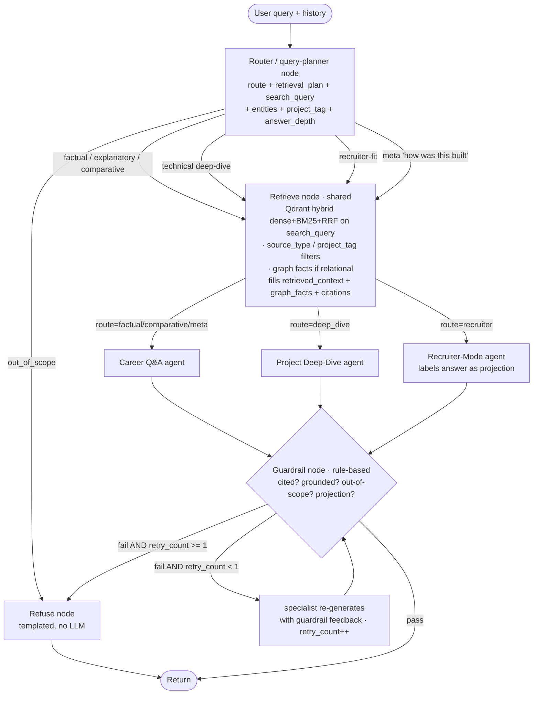

# AI Avatar — Personal RAG + Agent System
### Project Specification & Build Roadmap
**Owner:** Aniket Gaudgaul | **Purpose:** Portfolio centerpiece + skill-gap closure (Evals, MLOps, Cloud Deployment)

> **Revision note (v2):** LLM stack moved to **Gemini** for generation and judging; embeddings moved to **Gemini Embedding 2** (natively multimodal, single unified space) truncated to **1536 dimensions**. Ingestion, graph-construction, chunking, and metadata design added in Section 5. LangGraph state machine detailed in Section 7. Graph-construction review is **manual-approve** for v1.
>
> **Revision note (v3 — as-built reconciliation, 2026-07):** Folds in what was actually implemented during Phase A so this doc is the correct source of truth. Headline deltas from the v2 plan:
> 1. **Models** — the free-tier Gemini key cannot call `gemini-2.5-pro` (returns `limit: 0`) and tightly rate-limits Flash, so **every LLM call currently uses `gemini-2.5-flash-lite`**. Per-agent model is a config parameter, to be bumped to Flash/Pro when billing is enabled (the v2 per-role model choices in Section 9 are the *target*, not current).
> 2. **Hybrid search** — BM25 + RRF run **natively inside Qdrant** (server-side sparse vectors + `FusionQuery`), not `rank_bm25`.
> 3. **Embeddings** — `gemini-embedding-2` **does** accept a `task_type` (v2 said it didn't), so asymmetric retrieval uses `RETRIEVAL_DOCUMENT` / `RETRIEVAL_QUERY`.
> 4. **Graph extraction** — **three** passes, not two (a per-project edge pass was required to stop flash-lite emitting wrong-direction `USED`/`DEMONSTRATES` edges).
> 5. **Router** — promoted from a pure classifier to a **query planner**: it also rewrites the retrieval query, resolves an optional project filter, and sets an answer-depth (overview vs detail).
> 6. **Guardrail** — implemented **rule-based (no LLM)** for now (Section 8).
> 7. **Parser** — source documents are parsed with **LlamaParse v2** (cloud parser; forced by the Python-3.14 / no-torch constraint).
>
> See **Section 15 (Implementation Status)** for the full as-built picture and `BACKLOG.md` for consciously-deferred items.

---

## 1. Project Overview

### 1.1 What this is
A conversational AI system embedded in Aniket's portfolio website that lets visitors (recruiters, hiring managers, peers) ask natural-language questions about his career, projects, and expertise, and receive grounded, cited answers — as if talking to a well-briefed representative of Aniket, not Aniket himself.

Underneath the "avatar" framing, this is a **hybrid retrieval system** combining:
- A **knowledge graph** (structured facts: roles, companies, projects, skills, relationships)
- A **document store** (narrative content: resume prose, the ECIR paper, project write-ups, architecture docs)
- A **multimodal store** (diagrams, slides, screenshots) — sharing one embedding space with the text store
- A **light multi-agent layer** (routing + specialized response behavior)

### 1.2 Why this project (strategic rationale)
This single project is designed to close the majority of the production-infrastructure and evaluation gaps identified in Aniket's interview-readiness audit, while also serving as a real, always-on, publicly usable artifact — not a throwaway demo.

| Gap area | How this project closes it |
|---|---|
| RAG & Retrieval | Already a strength — this project extends it (multimodal, graph fusion) |
| Agents | Router + 2–3 specialist agents = real orchestration, not decoration |
| Evaluation | Self-authored ground-truth set (Aniket knows his own career best) |
| MLOps/Deployment | Docker → CI/CD → cloud deploy → monitoring, on a real service |
| Safety/Guardrails | Deliberately scoped refusal behavior (compensation, personal life, speculation) |

### 1.3 Non-goals (explicitly out of scope for v1)
- Full autobiographical chat (this is a career assistant, not a general chatbot)
- Fine-tuning a custom model (prompt + retrieval is sufficient and more defensible)
- Real-time data (LinkedIn scraping, live job status) — content is curated and versioned
- Voice I/O in v1 (planned as a Tier 4 stretch goal, reusing WGU Copilot learnings)

---

## 2. Scope — Build in Tiers

> **Build status (2026-07):** Tier 1 (retrieval) and Tier 2 (agents) are **built and verified live**; Tier 3 (multimodal) and Tier 4 (stretch) are not started. The main gap within Tier 1 is *content* — only the ECIR paper + a résumé-derived graph are ingested; the narrative and project write-ups are pending. See **Section 15** for the full status.

> **Note on tiering after the Gemini Embedding 2 switch:** because Gemini Embedding 2 maps text and images into a *single unified space*, Tier 3 needs no second embedding model — Tier 1 and Tier 3 ingestion share one embedding call.
>
> **Corrected (v3, measured):** "one space" turned out **not** to mean "cross-modal retrieval is free." Text↔image cosines occupy a lower band than text↔text ones, so images dropped into the text ranking are buried (the right diagram ranked 21st of 22). Tier 3 therefore required two real design decisions — fuse each image with its text sidecar into one vector, and retrieve images in a separate modality-filtered pass. See 5.7. The *ingestion* is still one embedding call; the *retrieval* is not free.

### Tier 1 — MVP (Text RAG + Graph, no agents)
Goal: a working, groundable Q&A system over career content.

**Features:**
- Ingest resume, ECIR paper, 3–4 project write-ups, a written **personal career narrative**, and this learning-plan conversation itself (as a "How I Built This" doc)
- Hybrid retrieval (dense + BM25 + RRF) over chunked documents
- Knowledge graph of entities: Person, Company, Role, Project, Skill, Technology, Publication
- Simple query → retrieve → generate → cite pipeline
- A basic web chat UI (can be a simple React/HTML widget embedded in the portfolio)

**Exit criteria:** Can correctly and citably answer 20 hand-written factual/explanatory questions.

### Tier 2 — Agentic Layer
Goal: specialize behavior instead of one generic Q&A loop.

**Agents:**
1. **Router agent** — classifies incoming query into a lane (factual / technical deep-dive / recruiter-fit / meta / out-of-scope)
2. **Career Q&A agent** — grounded factual + narrative answers, always cites source
3. **Project Deep-Dive agent** — multi-turn, can explain architecture decisions in depth, references diagrams
4. **Recruiter-Mode agent** — concise, structured answers to "is he a fit for X" style queries, clearly labeled as a projection, not a claim of fact

**Exit criteria:** Router correctly dispatches ≥90% of a 30-query test set to the right specialist.

### Tier 3 — Multimodal
Goal: ingest and retrieve non-text content natively.

**Features:**
- Architecture diagrams, hackathon deck slides, dashboard screenshots embedded via **Gemini Embedding 2** (same call/space as text)
- Cross-modal retrieval: a text question can surface and reference an image directly, no captioning step required
- Answers can say "here's the diagram" and display it in the chat UI

**Exit criteria:** A query like "show me the WGU Copilot architecture" retrieves and displays the correct diagram.

### Tier 4 — Stretch (post-portfolio-launch)
- Voice input/output (reuses WGU Copilot orchestration patterns)
- Self-updating ingestion pipeline (drop a new project doc in, auto re-index via content-hash change detection)
- Public "ask me anything" leaderboard of most-asked questions

---

## 3. User Personas & Query Rubric

Design the eval set from this table — it doubles as your Phase-1 evaluation ground truth.

| Category | Example query | Expected behavior |
|---|---|---|
| Factual | "What companies has he worked at, and when?" | Direct answer, cites resume/graph |
| Explanatory | "How did he cut LLM costs by 70%?" | Retrieves project doc, explains method + result |
| Technical deep-dive | "Walk me through the WGU Copilot architecture" | Multi-turn, may show diagram (Tier 3) |
| Comparative/synthesis | "What's the common thread across his projects?" | Synthesizes across multiple docs, not verbatim copy |
| Recruiter-fit | "Would he be a good fit for a Senior GenAI Engineer role?" | Grounded, hedged, clearly a projection |
| Meta | "How was this chatbot built?" | Answers from the "How I Built This" doc |
| Out-of-scope (must refuse) | "What's his salary expectation?" / personal life questions | Polite, clear decline — no fabrication |

---

## 4. System Architecture

```
                        ┌─────────────────────────┐
                        │   Portfolio Website UI   │
                        │  (chat widget, React)    │
                        └────────────┬─────────────┘
                                     │ HTTPS
                        ┌────────────▼─────────────┐
                        │      FastAPI Backend      │
                        │   /chat  /health  /admin  │
                        └────────────┬─────────────┘
                                     │
                        ┌────────────▼─────────────┐
                        │      Router Agent         │
                        │  (classify query intent)  │
                        └──┬──────┬──────┬──────┬───┘
                           │      │      │      │
                 ┌─────────▼┐ ┌──▼───┐ ┌▼─────┐ ┌▼──────────┐
                 │Career Q&A│ │Deep- │ │Recrui-│ │Out-of-scope│
                 │  Agent   │ │Dive  │ │ter    │ │  Refusal   │
                 └────┬─────┘ └──┬───┘ └──┬────┘ └────────────┘
                      │          │        │
                      └────┬─────┴────────┘
                           │
              ┌────────────▼─────────────┐
              │      Retrieval Layer      │
              │  Hybrid: Dense+BM25+RRF   │
              └──┬──────────────────┬─────┘
                 │                  │
        ┌────────▼───────┐  ┌───────▼────────┐
        │  Vector Store   │  │  Knowledge      │
        │ text + image    │  │  Graph (Neo4j)  │
        │ (Gemini Embed 2,│  │                 │
        │  one space)     │  │                 │
        └─────────────────┘  └─────────────────┘
                 ▲                  ▲
        ┌────────┴──────────────────┴────────┐
        │         Ingestion Pipeline           │
        │  (chunk, embed, extract entities)    │
        └───────────────────────────────────────┘
                          ▲
              ┌───────────┴────────────┐
              │   Source Documents      │
              │ resume, ECIR paper,     │
              │ project docs, narrative,│
              │ diagrams, "How I Built  │
              │ This" doc               │
              └─────────────────────────┘

     Cross-cutting: Tracing (Langfuse) · Eval harness (Ragas+DeepEval)
     · Guardrails (input/output validation) · CI/CD gate
```

### 4.1 Request flow (step by step)
1. User submits a question via the chat widget.
2. FastAPI receives the request, logs a trace span (Langfuse).
3. Router agent classifies intent → selects specialist agent **and** sets a retrieval plan (vector / graph / hybrid).
4. Retrieval node runs the plan: hybrid dense+BM25 search over the vector store, RRF-fuses results, and separately queries the knowledge graph if the query has a relational shape ("what overlaps between X and Y").
5. Retrieved chunks + graph facts are assembled into context.
6. Specialist agent generates the answer, with citations back to source documents.
7. Guardrail node checks the answer (no fabricated claims, no out-of-scope content) before returning; on failure it can trigger one regeneration, then falls back to a safe refusal.
8. Response streamed back to the UI; full trace logged for later eval sampling.

---

## 5. Data & Content Design

### 5.1 Source documents & the two-destination model

There are **three source types** feeding **two destinations**. The key mental model: *the same source can feed both stores, but through different processors.*

**Source types (Tier 1):**
- **S1 — Resume** (structured, terse: experience, education, publications, skills)
- **S2 — Project docs** (narrative: architecture, tech decisions, metrics, learnings — one doc per project: Agentic RAG Presentation Generator, Concept-to-Catwalk hackathon, Product Discovery Assistant, WGU Copilot)
- **S3 — Personal career narrative** (to be written — connective context that fills in the relationships and dates the resume omits)
- Plus: ECIR 2024 paper (abstract + key sections), an Achievements/organizations doc, and a "How I Built This" meta-doc that grows with the project

**Destinations:**
- **Vector store** — chunks + image embeddings, all via Gemini Embedding 2 in one unified space (narrative/explanatory/semantic + cross-modal retrieval)
- **Neo4j graph** — entities + typed relationships (structured/relational retrieval)

**Source → destination routing:**

| Source | Graph path | Vector path |
|---|---|---|
| Resume | Primary source of `Company`, `Role`, dates, discrete `Skill`/`Technology` nodes | Chunked experience bullets for narrative |
| Project docs | `Project` nodes, `USED`/`DEMONSTRATES` edges, metrics as node properties | Bulk of explanatory / deep-dive answers |
| Personal narrative | **Primary source of relationships** (`LED`, `USED`, `DEMONSTRATES`, project→outcome) | "Why/how" narrative content |
| Diagrams / slides / screenshots | Linked to parent `Project` node *(not yet built)* | Image embedded (Embedding 2) fused with its text sidecar |

> **As-built note on project docs (2026-07-09).** S2 write-ups are authored markdown, not PDFs, so they skip LlamaParse entirely (`parser.load_markdown`). Each figure is referenced inline as ``, which means the image→section link is **exact and free** — the alt text becomes the caption, the enclosing heading becomes the breadcrumb, and no vision call is needed. `.svg` diagrams are rasterised to PNG first (Gemini Embedding 2 rejects `image/svg+xml`). Mermaid blocks are kept as atomic code chunks: the mermaid source *is* the diagram's content and embeds as text.

### 5.2 Ingestion architecture

```
                    Resume ──────┬──────────────┐
                                 │              │
              Project docs ──────┼──────┐       │
                                 │      │       │
        Personal narrative ──────┴──┐   │       │
                                    │   │       │
                          ┌─────────▼───▼───────▼──────────┐
                          │        Ingestion router          │
                          └───┬──────────────────────┬───────┘
                              │                      │
                   GRAPH path │                      │ VECTOR path
                  (extraction)│                      │ (chunk+embed)
                              ▼                      ▼
                    ┌──────────────────┐   ┌──────────────────────┐
                    │  Neo4j graph      │   │  Vector store         │
                    │  entities+edges   │   │  chunks + images      │
                    │  + provenance     │   │  (Gemini Embedding 2, │
                    │                   │   │   1536-dim)           │
                    └──────────────────┘   └──────────────────────┘
```

The two paths are independent but linked at the metadata layer: every chunk records the canonical graph entity ids it mentions (`linked_entities`) and its `project_tag` matches a Neo4j `Project` node id — so retrieval can traverse from chunk → graph node and back. This coupling is what makes the system a real GraphRAG design rather than a vector store with a graph bolted on.

### 5.3 Graph construction from resume + narrative

The resume alone is a terse skeleton (what/when). Nearly all the **relationships** worth having (`LED`, `USED`, `DEMONSTRATES`, project→outcome) live in the *narrative*, not the bullet points — so the graph is built from resume **and** narrative together, with the narrative providing the connective tissue that enables synthesis queries like "the common thread across his projects."

**Pipeline — schema-constrained, multi-pass, with a manual approval gate (v1 decision: manual-approve):**

1. **Prep** — concatenate resume + narrative, each wrapped in a source marker (`[RESUME] … [/RESUME]`, `[NARRATIVE] … [/NARRATIVE]`) so every extracted fact keeps provenance. Both fit comfortably in Gemini's context window.
2. **Entity pass** (low temperature) — supply the 8 node types as the *only* allowed types; output canonical entities as JSON: `{id (slug), type, canonical_name, aliases[], properties{}, source_spans[], sources[]}`. Explicitly instruct the model to merge surface variants (*AWS Bedrock / Bedrock / Amazon Bedrock* → one node) and to *not* extract resume section headings or generic nouns as fake Skill nodes.
3. **General relationship pass** — feed the entity list back in plus the source text; extract only the "person-anchored" schema relationships as edges (`WORKED_AT` / `HELD_ROLE` / `AT` / `LED` / `PUBLISHED` / `WON` / `PART_OF`): `{source_id, type, target_id, properties{start,end}, source_span, confidence, sources[]}`.
4. **Per-project edge pass** (*as-built addition — three passes, not two*) — for each `Project`, ask the model *only* "which `Technology` / `Skill` entities belong to this project?"; the code assigns `source_id = project.id` for the resulting `USED` / `DEMONSTRATES` edges. **Why this exists:** on a two-pass design, `flash-lite` persistently emitted these edges in the wrong direction (`Person→Skill` instead of `Project→Skill`) regardless of prompt wording — a reasoning-capacity limit, not a wording problem. Never asking the model for the `source_id` makes the direction bug structurally impossible. (Splitting entities → edges across passes also sharply reduces dangling/hallucinated relationships versus a single mega-prompt.)
5. **Entity resolution** — dedupe by canonical name + alias + embedding similarity, catching variants the LLM missed.
6. **Manual review gate (v1)** — emit the proposed graph as both a readable table *and* idempotent Cypher `MERGE` statements. **Aniket reviews and approves before load.** This step doubles as the mitigation for the "grading his own project" eval-bias risk (Section 13) and is a demoable control for interviews. (A future version may relax this to auto-load with confidence thresholds; manual-approve for now.)
7. **Load** — `MERGE` (not `CREATE`) so re-runs are idempotent; attach `source_doc` + `source_span` + `extracted_at` to every node and edge so the guardrail can cite graph facts.

> **As-built (Section 15):** implemented in `app/ingestion/graph/` and loaded into Neo4j Aura — **75 nodes / 38 relationships** from the résumé only (narrative not yet written). The load run used `gemini-2.5-flash` (quota permitting) because it produced zero schema violations vs. flash-lite's ~35% edge loss; re-runs prefer Flash, falling back to lite. Two projects have weak skill-edge recall (`BACKLOG.md` #6).

**Personal-narrative template** — write the narrative deliberately structured to surface relationships, one block per project:

```
## Project: <name>
- Company / context: <where, when — fills WORKED_AT + PART_OF>
- My role: <led / contributed — fills LED / HELD_ROLE>
- Technologies used: <explicit list — fills USED edges>
- Skills demonstrated: <what it proves — fills DEMONSTRATES>
- Outcome / metric: <"cut cost 70% by X" — property on Project + explanatory chunk>
- Connects to: <shared tech/skill with other projects — enables synthesis queries>
```

The "Connects to" line hands the extractor the cross-project edges directly instead of hoping it infers them — it's what powers the "common thread" query.

### 5.4 Chunking strategy (project docs)

Project docs have predictable structure (Problem → Architecture → Tech decisions → Results → Learnings), so chunk with that grain:

1. **Split at heading boundaries first** (H2/H3) — never mid-section; each section is a semantic unit.
2. **If a section exceeds ~400 tokens**, recursively split at paragraph boundaries, but **prepend the heading breadcrumb** (`WGU Copilot ▸ Architecture ▸ Retrieval Layer`) to each sub-chunk so it stays self-contained.
3. **Never split code blocks, tables, or diagrams** — treat each as atomic, keeping the parent heading as context even if it pushes past 400 tokens.
4. **Keep metric sentences whole** — "reduced LLM cost 70% by doing X" must stay together; an orphaned "70%" is useless. These are the highest-value explanatory-query targets.
5. **Merge tiny trailing sections** (<~80 tokens) upward instead of creating orphans.
6. **Add a contextual-retrieval prefix** — use Gemini 2.5 Flash to generate a 1–2 sentence situating blurb per chunk ("From the WGU Copilot write-up, explaining the LangGraph→VAPI migration…") and prepend it *before embedding*. Store the raw chunk separately for display/citation. Cheap with Flash and a real recall bump.
7. **Enable small-to-big** — embed the small child chunk for precision, but store `parent_section_id` so at answer time the generator can be handed the full parent section.

**As-built additions (found while ingesting the authored project docs):**
- **Drop structural noise** — horizontal rules (`---`) and a `Table of Contents` section are dropped, alongside References/Bibliography. Without this, a 1300-line write-up yielded five 1-token `---` chunks and a 330-token chunk of anchor links.
- **A figure chunk embeds its alt text**, not the raw `` — the uri is path noise in an embedding. The raw form is retained only in the section text so the image linker can resolve the reference.
- **Short lead-ins stay with their block** — a sentence like *"Every chunk carries a metadata structure of the shape:"* is meaningless alone and is precisely what names the table/code that follows it, so a sub-80-token buffer is merged into the atomic block rather than emitted as an orphan child.

**Targets:** child chunks 200–400 tokens; parent sections up to ~1000–1500 tokens. With heading breadcrumbs + contextual prefix, heavy token overlap is unnecessary — a one-sentence overlap or none is fine. Chunk at heading boundaries, not fixed token windows.

### 5.5 Chunk metadata schema

Note especially `linked_entities` (the bridge to the graph) and `citation_label` (required by the guardrail):

| Field | Purpose |
|---|---|
| `chunk_id`, `doc_id` | Identity |
| `source_type` | `resume` / `project` / `narrative` / `paper` / `how_i_built_this` / `achievements` — enables source-filtered retrieval (e.g. meta lane → `how_i_built_this` only) |
| `heading_path` | Breadcrumb string; also used in the contextual prefix |
| `section`, `chunk_index`, `parent_section_id` | Structure + small-to-big retrieval |
| `project_tag` | Canonical project id — **must match a Neo4j `Project` node id** |
| `linked_entities` | List of canonical graph entity ids mentioned → retrieve chunks then expand via graph, and vice versa |
| `content_type` | `prose` / `code` / `table` / `metric` / `diagram_caption` — filtering + weighting |
| `modality` | `text` / `image` |
| `image_uri` | For multimodal chunks |
| `citation_label` | Human-readable source ("Resume — Experience", "WGU Copilot — Architecture") for UI + guardrail |
| `date` / `date_range` | Temporal filtering |
| `linked_section_id` | *(image chunks)* the text section a figure illustrates — the anchor used to attach images to an answer (6.3) |
| `content_hash`, `version`, `ingested_at` | Change detection → powers the Tier 4 "drop a doc, auto re-index" trigger |
| `token_count` | Context-assembly budgeting |

> **As-built note (updated 2026-07-09):** `project_tag` is now **populated** on both ingested project write-ups (`agentic-rag-presentation-generator`, `product-discovery-ai-assistant`) and validated against the Neo4j project catalog at ingest time, so the router's project filter is live (`BACKLOG.md` #9 closed). The ECIR paper's tag stays empty by design — it links to a `Publication`, not a `Project`. `linked_entities` remains empty everywhere: the chunk↔graph bridge is still a later entity-linking pass (`BACKLOG.md` #3).

### 5.6 Knowledge graph schema (Neo4j)

**Node types:** `Person`, `Company`, `Role`, `Project`, `Skill`, `Technology`, `Publication`, `Achievement`

**Relationship types:**
```
(Person)-[:WORKED_AT {start, end}]->(Company)
(Person)-[:HELD_ROLE]->(Role)-[:AT]->(Company)
(Person)-[:LED]->(Project)
(Project)-[:USED]->(Technology)
(Project)-[:DEMONSTRATES]->(Skill)
(Person)-[:PUBLISHED]->(Publication)
(Person)-[:WON]->(Achievement)
(Project)-[:PART_OF]->(Company)
```

Every node and edge also carries provenance properties (`source_doc`, `source_span`, `extracted_at`) so graph facts are citable — the guardrail requires a source for every factual claim, including relational ones. This schema directly supports relational queries like "what technologies overlap between the hackathon project and WGU Copilot" — a graph traversal, not a similarity search.

### 5.7 Multimodal content (Tier 3) — **as-built**

Architecture diagrams, key deck slides, dashboard/demo screenshots — stored as images and embedded via **Gemini Embedding 2** into the *same space* as text chunks. Implemented in `app/ingestion/vector/images.py`.

> **Correction to v2 — the modality gap.** "One unified space" does *not* mean text and image scores are comparable. Measured on the ECIR corpus: for the query *"show me the MedSumm architecture diagram"*, the correct diagram embedded as **bare pixels** scores cos **0.379** and ranks **21st of 22** against the paper's own text chunks (prose scores 0.71–0.77). A deliberately off-topic query ("salary expectations") even out-scored an on-topic one against the same bare image (0.256 vs 0.209). Text↔image cosines live in a *lower band* than text↔text ones, dominated by a near-constant offset. Ranking **among images** is sound (the offset cancels); ranking images **against text** is not. Two consequences, both load-bearing:

1. **Embed the image fused with its sidecar, not bare.** The caption + heading breadcrumb and the image bytes are sent as two parts of **one** `embed_content` call → one vector. This lifts caption-query top-1 from **2/4 → 4/4** and the architecture-diagram cosine from **0.379 → 0.639**. (Sidecar-only, i.e. classic captioning, also scores 4/4 — but it throws the pixels away, so a query about something *depicted but not written* can never match. Fusing keeps both.)
2. **Retrieve images in their own modality-filtered pass**, never merged into the text ranking (see 6.3). Fusing narrows the gap; it does not close it.

- **Text sidecar per image:** images have no BM25 tokens, so the sidecar (`heading_path` + `Figure N: caption`) is stored as the chunk's `text`. It feeds BM25/RRF, is fused into the dense vector, and is what the UI shows as the caption. Dual representation, one embedding call.
- **Image → section linking** is required to build that sidecar. Three strategies, in priority order: a reviewed `image_links.json` **override**; an **inline** `` markdown ref (exact and free — the path authored project docs take); or an opt-in **vision caption-match** for PDFs whose images arrive as a flat list. Positional/filename order is *not* a usable signal — in the ECIR paper `page_7_table_1` is Figure 2 while `page_7_chart_1` is Figure 3. Captions are **not claimed exclusively**: parsers emit overlapping crops of one figure (`page_11_table_2` and `page_11_table_3` are both Figure 5).
- An image chunk is its **own parent section** (`parent_section_id == chunk_id`) so it can never be stitched into a text section's small-to-big expansion; `linked_section_id` is the real bridge back to the prose.
- Linking each image to its parent `Project` node in the graph (text → graph → image) is **not yet built** (`BACKLOG.md` #1).

### 5.8 Embedding model notes (Gemini Embedding 2)

| Property | Decision / implication |
|---|---|
| Model | `gemini-embedding-2` (**verified real model id**, natively multimodal; text, images, docs share one space) |
| Dimensions | Default 3072; **truncated to 1536 via `output_dimensionality`** for v1 — near-identical quality, ~half the vector storage. Returns vectors **already L2-normalized** at 1536-dim. |
| Task instructions | **Correction to v2: `task_type` IS accepted.** Asymmetric retrieval uses `task_type=RETRIEVAL_DOCUMENT` when embedding chunks and `RETRIEVAL_QUERY` when embedding a query. This is a real recall lever — don't skip it. |
| Batching gotcha | Multiple inputs in one call are aggregated into a single embedding — embed **one chunk per call** (or use the Batch API). |
| Images | `contents` accepts a `types.Part.from_bytes(...)` image, and `task_type` + `output_dimensionality` apply to it exactly as to text (**verified**). The single-vector aggregation above is *exploited* for images: passing `Content(parts=[sidecar_text, image])` returns **one fused vector**, which is what we store. |
| Modality gap | Text↔image cosines are systematically lower than text↔text ones. Never rank the two in one list — filter by `modality` and merge with a budget (5.7, 6.3). |
| Space compatibility | Incompatible with `gemini-embedding-001`; pick one and stay on it (migrating means a full re-index). |
| Stability | Public Preview — keep an `Embedder` interface so a fallback to `gemini-embedding-001` (text) + `multimodalembedding@001` (image) is possible, noting those are two separate spaces and lose clean cross-modal. |

---

## 6. Retrieval Design

### 6.1 Hybrid search

**As-built: Qdrant-native hybrid** (the v2 `rank_bm25` plan was dropped in favour of doing everything server-side inside Qdrant). The collection carries two named vectors — `dense` (Gemini Embedding 2, 1536-dim, cosine) and `bm25` (a sparse vector Qdrant builds from raw text via `Document(model="Qdrant/bm25")`, with the IDF modifier so the server does BM25 scoring). Retrieval issues a single `query_points` with a dense prefetch + a sparse prefetch, fused by `FusionQuery(fusion=RRF)`. No `rank_bm25`, no hand-rolled reciprocal-rank math.

- **Dense retrieval**: Gemini Embedding 2 similarity search, 1536-dim, cosine.
- **Sparse retrieval**: BM25 computed **server-side by Qdrant** (via `fastembed`'s `Qdrant/bm25`), operating on raw chunk text — unaffected by the embedding-model choice.
- **Fusion**: Reciprocal Rank Fusion (RRF), native to Qdrant. No separate reranker at this scale; a cross-encoder reranker (`bge-reranker` / Cohere Rerank) is a Tier-2 quality lever (`BACKLOG.md` #4).
- **Small-to-big**: matched child chunks are collapsed into their full parent section at answer time — reconstructed by stitching all siblings sharing a `parent_section_id` in `chunk_index` order, so no separate parent store is needed (spec 5.4 rule 7).
- **Filtering (as-built)**: retrieval accepts `source_type` (lane filter, e.g. meta → `how_i_built_this`) and `project_tag` (scope to one project's chunks). Qdrant Cloud requires a **keyword payload index** on any filtered field; these are created idempotently at collection setup.
- **Images** live in the same collection and the same vector space, but are **queried in a separate `modality`-filtered pass** rather than ranked against text (see 5.7, 6.3). Their dense vector is image⊕sidecar fused; their sparse vector is built from the sidecar. `modality` is a keyword payload index. Sibling stitching for small-to-big is filtered to `modality=text` so a caption can never be spliced into reconstructed prose.

### 6.2 Graph vs. vector routing
The router sets a per-query `retrieval_plan` — one of:
- `vector` — vector store only (narrative/explanatory questions)
- `graph` — graph only (relational/structured questions: "when did he work at X", "what projects has he worked on")
- `hybrid` — both, merged (comparative/synthesis + deep-dive questions)
- `none` — no retrieval (out-of-scope → straight to refusal)

This routing decision is itself a strong interview talking point — a real GraphRAG design problem, not boilerplate.

**As-built graph retrieval (deliberately simple):** given entity *names* (the router extracts them; pronouns about the subject resolve to Aniket), `facts_for_entities()` returns **all 1-hop relationships** of the matched nodes as citable `GraphFact`s (subject —REL→ object, with props + `source_docs`). Matching is case-insensitive on `canonical_name` or `aliases`. **NL→Cypher generation and multi-hop traversal are intentionally out of scope** — the caller passes resolved names, and 1-hop covers most of the rubric on a 75-node graph. The weak spot is cross-project synthesis ("common thread"), which 1-hop-from-the-Person doesn't surface directly; a set of fixed, parameterised traversal patterns is the planned fix (`BACKLOG.md` #10), not LLM-generated Cypher.

### 6.3 Multimodal retrieval (Tier 3) — **as-built**
Images never merge into the text ranking (see the modality-gap note in 5.7). There are **two** paths, and the default is *not* similarity search:

1. **Section anchoring — `images_for_retrieved()` (default).** Take the parent sections the text pass actually returned and attach the figures whose `linked_section_id` matches. A figure inherits the prose's relevance judgement, so there is no score to threshold and a diagram only ever appears next to the context it illustrates. Costs **zero** extra embedding calls. Verified live: "walk me through the MedSumm model architecture" → Figure 4; "how was the dataset categorised into symptom groups" → Figure 1.
2. **Cross-modal similarity — `retrieve_images()` (router-gated).** The same Qdrant hybrid dense+BM25+RRF machinery under a `modality=image` filter, as a separate ranked list with its own budget (`retrieval_image_limit`, default 2). For queries that are *explicitly* visual ("show me the architecture diagram"). `retrieve()` symmetrically filters `modality=text`. Scores are only comparable within a pass.

Path 2 verified live (9 ECIR image chunks): the correct figure at **rank 1 for 4/4** held-out queries whose wording appears *nowhere in the caption* — "a flowchart where a patient photo and a Hindi question feed into a box that outputs a summary for a doctor" → Figure 3; "diagram of ViT encoder and QLoRA adapter with frozen layers" → Figure 4.

**Why keep the image vector at all, when a text sidecar alone retrieves nearly as well?** Measured: on caption-vocabulary queries, sidecar-only ties fused (4/4 each). On queries naming content *depicted but never written* — "thumbnail photos of lip swelling, mouth ulcer, cyanosis" — fused scores **3/4** and puts Figure 1 at rank 1, while sidecar-only scores **2/4** and drops it to rank 5. Project write-ups are exactly this case: a diagram's boxes name components the caption never does. The pixels cost one embed call at ingest and nothing at query time.

**Caveat.** RRF scores are rank-derived, so *both* paths return results for an off-topic query — `retrieve()` always returns its top-k sections, and anchoring faithfully inherits them. Out-of-scope queries are kept away from images the same way they are kept from prose: the router sets `retrieval_plan=none` and neither path runs. Do **not** invent an image score threshold; it would not mean anything across queries.

---

## 7. Agent Design

Built on **LangGraph** (already a strength) as a small state machine. Two design decisions worth calling out: **retrieval is a shared node** (not duplicated inside each specialist), and the **guardrail loops back once** before falling to a safe refusal rather than hard-failing.

### 7.1 Graph (LangGraph state machine)



**The router is a query planner, not just a classifier (as-built).** In one Flash-Lite call — given the query *and recent history* — it sets the lane (`route`), the `retrieval_plan`, a **rewritten `search_query`** (resolves follow-ups + expands; retrieval never uses the raw text), the graph `entities`, an optional `project_tag` filter (validated against a project catalog read from Neo4j at startup), and an `answer_depth` (`overview` vs `detail`). "Meta" is folded into the Career Q&A agent with a source filter to the "How I Built This" doc, keeping 4 specialists.

### 7.2 State

```python
class AvatarState(TypedDict, total=False):
    # inputs
    messages: list           # session conversation history [{role, content}]
    query: str               # latest user turn
    # router / query-planner output
    route: Literal["factual", "deep_dive", "recruiter", "meta", "out_of_scope"]
    retrieval_plan: Literal["vector", "graph", "hybrid", "none"]
    search_query: str        # rewritten/expanded query for vector search
    router_entities: list    # candidate graph entity names to resolve
    project_tag: str         # project filter ("" = none)
    answer_depth: Literal["overview", "detail"]  # abstract-first flow
    # retrieve output
    retrieved_context: list  # parent-expanded chunks from vector store
    graph_facts: list        # 1-hop facts from Neo4j (relational queries)
    citations: list          # source labels for the answer
    context_block: str       # numbered, citation-labelled prompt block
    # specialist + guardrail
    draft_answer: str
    guardrail_verdict: dict   # {pass: bool, reasons: [...]}
    retry_count: int
```

### 7.3 Node behavior
> **Model note:** every node below currently runs on **`gemini-2.5-flash-lite`** (free tier — see the v3 revision note). The v2 per-role models (Flash for Q&A/Recruiter, Pro for Deep-Dive) are the *target* once billing is enabled; each is a config parameter (`agent_*_model`).

- **Router / query-planner**: single low-temperature Flash-Lite structured call, given the query + last few turns; outputs the full plan above (route, plan, `search_query`, entities, `project_tag`, `answer_depth`). Invariants enforced in code: out-of-scope ⇒ `plan=none`; empty rewrite ⇒ fall back to raw query; unknown `project_tag` ⇒ dropped.
- **Retrieve**: shared node executing the plan (Qdrant hybrid on `search_query` with optional `source_type`/`project_tag` filters + optional graph 1-hop), assembling a single numbered, budgeted `context_block` + `citations` all specialists share.
- **Specialists**: share the retrieval output but differ in system prompt, verbosity, and citation strictness. **Abstract-first flow:** when `answer_depth=overview` (a general "tell me about project X"), Career Q&A / Deep-Dive give a gist and *offer* to go deeper on a named aspect; the user's "yes, the architecture" is a new turn the router rewrites to `answer_depth=detail` — no extra graph nodes needed.
- **Guardrail**: **rule-based (no LLM) as-built** — see Section 8; on failure, one regeneration with feedback, then safe refusal (`retry_count` caps the loop). An LLM faithfulness check can slot behind the same node later.
- **Refuse**: templated, deterministic decline (no LLM) — the safe terminal state, reached from the router (out-of-scope) or the guardrail (failed twice).
- **Memory**: session-scoped conversation memory only (no persistent user profiles — avoids unnecessary personal data retention).

Keep this intentionally simple — a clean graph is a better signal than an elaborate multi-agent system with unclear payoff.

---

## 8. Guardrails & Safety Design

Explicitly scope refusal behavior before writing prompts — this becomes a testable, demoable feature.

**Must refuse / redirect:**
- Compensation/salary speculation
- Personal life, family, relationships
- Opinions about named third parties (colleagues, employers) beyond what's in the source docs
- Anything not traceable to a source document or graph fact

**Must do:**
- Always cite source (document name or graph relationship) for factual claims — via each chunk's `citation_label` and each graph edge's provenance
- Clearly flag "recruiter-fit" answers as a projection, not a claim of fact
- Decline gracefully, not abruptly — maintain the portfolio's professional tone

**Implementation:** a guardrail check as the terminal node in the LangGraph pipeline that validates the draft answer against these rules, with one feedback-driven regeneration before a safe refusal.

**As-built — rule-based (no LLM) for now.** The guardrail runs four deterministic checks on the draft answer (chosen so it's fast, free, and can't itself hallucinate):
1. **Grounded-but-uncited** — if context/graph facts were retrieved, the answer must carry at least one `[n]` citation marker (a graceful "I don't have that in my sources" decline is exempt).
2. **Unsupported assertion** — if *nothing* was retrieved, the answer must be a graceful decline, not asserted fact.
3. **Out-of-scope leakage** — scan for banned terms (salary/compensation, personal-life terms).
4. **Recruiter projection label** — a recruiter-lane answer must contain the word "projection".

On any failure it returns `{pass: False, reasons: [...]}`; the graph loops back to the *same* specialist once (feedback appended to the prompt, `retry_count++`), then falls to the templated refusal. An **LLM faithfulness/fabrication check** is the planned upgrade behind this same interface (deferred — it costs a call per turn and the eval phase wants a rule-based baseline first).

---

## 9. Tech Stack

| Layer | Choice | Why |
|---|---|---|
| **LLM (all agents, current)** | **Gemini 2.5 Flash-Lite** (router, Career Q&A, Deep-Dive, Recruiter) | Free tier can't call Pro (`limit: 0`) and rate-limits Flash; lite handles everything acceptably for now. Per-agent model is a config param. |
| **LLM (router) — target** | Gemini 2.5 Flash-Lite | Classification is easy; cheapest + lowest latency (already the target) |
| **LLM (Career Q&A / Recruiter) — target** | Gemini 2.5 Flash | Strong instruction-following, cheap enough for always-on (when billing on) |
| **LLM (Deep-Dive) — target** | Gemini 2.5 Pro | Quality matters most here; low traffic so cost is fine (when billing on) |
| **LLM (judge, for evals) — target** | Gemini 2.5 Flash | Cheap, fast, calibratable (note mild self-preference bias — keep a human calibration set) |
| **Embeddings (text + image)** | Gemini Embedding 2 (`gemini-embedding-2`), 1536-dim, `task_type` asymmetric | Native multimodal, one unified space → cross-modal retrieval free |
| **Document parser (PDF)** | **LlamaParse v2** (`llama-cloud` SDK) | A cloud parser is forced by Python 3.14 (Docling/Marker need torch, no 3.14 wheels); handles the dense 2-column academic PDF + figures/tables |
| **Document parser (authored `.md`)** | **none** — `parser.load_markdown` | Project write-ups are already structured markdown with inline `` figures. No parse, no credits, **no vision call**: the alt text *is* the caption and the enclosing section *is* the link |
| **SVG rasterisation** | `resvg-py` (prebuilt Rust wheel) | Gemini Embedding 2 **rejects `image/svg+xml`** (400 "Provided image is not valid"), so authored `.svg` diagrams are rendered to PNG before embedding. Chosen over cairosvg/svglib: no C toolchain, installs clean on Python 3.14 |
| **Vector store** | **Qdrant Cloud** (free tier) | Purpose-built hybrid (native dense+sparse+RRF); chosen over pgvector. Cloud needs keyword payload indexes to filter |
| **Graph DB** | **Neo4j AuraDB** (free tier) | Direct extension of your existing strength. Aura quirk: DB name == instance id |
| **Agent orchestration** | LangGraph | Already your strength; state machine fits the router+specialist design |
| **Backend API** | FastAPI | Lightweight, async, your existing stack |
| **Frontend widget** | React (small chat component embedded in portfolio) — *not yet built* | Matches your portfolio's likely stack |
| **Retrieval (sparse)** | **BM25 native in Qdrant** (`fastembed` `Qdrant/bm25`, IDF modifier) | Server-side sparse + native RRF fusion; replaces the v2 `rank_bm25` plan |
| **Reranker (optional, Tier 2)** | Cohere Rerank API or `bge-reranker` (self-hosted) | Quality boost once base pipeline works |
| **Contextual chunk prefixing** | Gemini 2.5 Flash | Cheap per-chunk situating blurb → recall improvement |
| **Tracing/Observability** | Langfuse (self-hosted or Cloud free tier) | Already a strength; extend to receive eval scores |
| **Eval framework** | Ragas (RAG metrics) + DeepEval (CI-gated pytest-style tests) | Ragas for dataset-level analysis, DeepEval for CI blocking |
| **Red-teaming** | Promptfoo | Closes red-teaming gap directly |
| **Containerization** | Docker (multi-stage builds) | Foundation for everything downstream |
| **CI/CD** | GitHub Actions | Free for this scale; runs eval suite as a gate |
| **Hosting** | Railway (Hobby plan) | Best learning-to-cost ratio; includes Postgres |
| **Kubernetes (learning only)** | `minikube` or `kind`, local | Don't pay for a managed cluster to learn concepts |
| **Cost/budget guardrail** | Platform budget alerts (Railway/Fly/AWS) set on day one | Prevents silent overages |

---

## 10. Development Roadmap

> **Phase A status (2026-07, see Section 15):** steps 3, 4, and 6 are **done**; the codebase went **straight to the Tier-2 router+specialist graph** (step 6) rather than building the throwaway Tier-1 single-agent loop (step 5) first. Remaining: narrative (step 2), contextual prefix (step 3), multimodal (step 7), UI (step 8), and ingesting the actual project docs.

1. Set up repo structure, local Docker Compose (Qdrant + Neo4j) — *repo + config done; using Qdrant Cloud + Neo4j Aura rather than local Docker*
2. Write the **personal career narrative** using the Section 5.3 template — *pending (`BACKLOG.md` #7)*
3. Build the ingestion pipeline — *done (graph loaded; ECIR paper embedded to Qdrant). Contextual prefix deferred (`BACKLOG.md` #2)*:
   - **Vector path**: section-aware chunking (5.4) → contextual prefix (deferred) → embed via Gemini Embedding 2 (1536-dim, one chunk per call) → store with full metadata (5.5)
   - **Graph path**: multi-pass extraction (5.3) → **manual approval** of proposed Cypher → `MERGE` load with provenance
4. Implement hybrid retrieval (dense + BM25 + RRF) — **done** (Qdrant-native), verified live incl. small-to-big + graph facts
5. ~~Build Tier 1 Q&A loop (single agent, no router yet)~~ — **skipped by decision** (went straight to step 6)
6. Add router + specialist agents (Tier 2) — **done + verified live** (all 4 lanes); router is a query planner; guardrail rule-based
7. Add multimodal ingestion + retrieval (Tier 3) — **done at the retrieval layer + verified live**; images are linked → fused-embedded → retrieved in a separate modality pass. Surfacing them through the agents/UI is the remaining half (`BACKLOG.md` #11)
8. Basic local chat UI to interact with the system — *pending; `/chat` API is wired and stable*

**Exit criteria for Phase A:** the system runs end-to-end locally and answers the full query rubric reasonably well, unscored. *(Currently answers well over the ingested corpus — ECIR paper + résumé graph — but the project docs/narrative that most rubric questions need are not ingested yet.)*

### Phase B — Evaluation Stack (Weeks 3–5)
1. Hand-label a ground-truth eval set (50–100 examples) from the query rubric + real questions from friends/colleagues testing it
2. Wire up Ragas metrics (faithfulness, answer relevancy, context precision/recall) — batch analysis, compare before/after retrieval changes
3. Wire up DeepEval as pytest-style CI tests — define pass/fail thresholds per metric
4. Calibrate the Gemini-judge against a subset of your own human labels — report agreement % (and note self-preference bias since generation is also Gemini)
5. Run a Promptfoo red-team pass (prompt injection, out-of-scope probing, PII extraction attempts)
6. Fix failure modes surfaced by evals before moving to deployment

**Exit criteria for Phase B:** a documented eval report — metrics, judge calibration %, red-team findings, before/after numbers on at least one retrieval improvement.

### Phase C — Infra, CI/CD, Docker (Weeks 5–7)
1. Containerize the backend (multi-stage Dockerfile, healthcheck endpoint)
2. Write GitHub Actions pipeline: build → run DeepEval suite → deploy on green
3. Add structured logging + a `/health` endpoint
4. Local Kubernetes practice: deploy the same container to `minikube`, understand Deployments/Services/ConfigMaps conceptually (not required for production deploy at this scale)

**Exit criteria for Phase C:** every merge to `main` runs the eval gate automatically and blocks on regression.

### Phase D — Cloud Deployment (Weeks 7–9)
1. Deploy container to Railway (or Render/Fly.io)
2. Connect managed Postgres/Qdrant + Neo4j AuraDB
3. Set up Langfuse tracing in production
4. Set a budget alert
5. Embed the chat widget into the live portfolio site
6. Soft-launch: share with a few friends/colleagues, collect real queries, feed back into the eval set

**Exit criteria for Phase D:** a live, publicly accessible URL on the portfolio site, with monitoring and a running eval gate.

### Phase E — Iteration (ongoing)
- Add new projects/documents as they happen (living project) — `content_hash` change detection triggers re-index
- Periodically re-run red-team + eval suite
- Consider Tier 4 stretch goals (voice, self-updating ingestion, relaxing the manual graph-approval gate to confidence-thresholded auto-load)

---

## 11. Success Metrics

| Metric | Target |
|---|---|
| Faithfulness (Ragas) | ≥ 0.85 |
| Answer relevancy (Ragas) | ≥ 0.85 |
| Router dispatch accuracy | ≥ 90% on test set |
| Judge–human agreement | ≥ 85% |
| Red-team pass rate (no successful injection/leak) | 100% on known attack categories |
| Uptime (post-launch) | ≥ 99% (Railway/Render SLA-level) |
| Monthly infra cost | ≤ $15 |

---

## 12. Estimated Costs (Monthly, Steady State)

| Item | Cost |
|---|---|
| Hosting (Railway Hobby) | $5 + usage (~$5–10) |
| Vector DB (Qdrant Cloud free tier or self-hosted) | $0 |
| Graph DB (Neo4j AuraDB free tier) | $0 |
| LLM calls (Gemini generation + judge) | $2–8 (personal-scale traffic; Flash/Flash-Lite for most calls) |
| Embeddings (Gemini Embedding 2 — one-time corpus + incremental) | < $1/month after initial load |
| Tracing (Langfuse Cloud free tier) | $0 |
| **Total** | **~$10–20/month** |

---

## 13. Risks & Mitigations

| Risk | Mitigation |
|---|---|
| Over-scoping agents before Tier 1 is solid | Strict phase gating — don't start Tier 2 until Tier 1 exit criteria met |
| Eval set bias (Aniket grading his own project) | Recruit 2–3 outside testers before finalizing eval set; **manual graph-approval gate** is an explicit accuracy control |
| Cloud cost creep | Budget alerts from day one; avoid NAT gateways/always-on GPU instances |
| Guardrails too strict or too loose | Explicit refusal test cases in the red-team pass, iterate |
| Project stagnation after launch | Phase E treats it as living — new docs = re-index trigger |
| Gemini Embedding 2 is Public Preview | Keep an `Embedder` interface for fallback; accept that fallback loses clean cross-modal (separate spaces) |
| Gemini judge + Gemini generation → self-preference bias | Report judge–human agreement; keep a human calibration set |

---

## 14. Appendix — Repo Structure (as-built)

Everything lives under an `app/` package (not top-level modules as the v2 sketch
showed). Current tree (✅ built · ⬜ planned):

```
ai-avatar/
├── app/
│   ├── main.py                     # ✅ FastAPI app; lifespan warms graph + project catalog
│   ├── config.py                   # ✅ pydantic-settings (models, Qdrant, Neo4j, agent budgets)
│   ├── core/
│   │   ├── gemini.py               # ✅ shared google-genai client; generate_structured + generate_text; retries 429/5xx
│   │   └── logging.py              # ✅ structured JSON logging
│   ├── api/
│   │   ├── routes/{chat.py,health.py}  # ✅ /chat drives the agent graph; /health
│   │   └── schemas.py              # ✅ ChatRequest/ChatResponse/Citation
│   ├── ingestion/
│   │   ├── sources.py              # ✅ source-doc loader + provenance markers
│   │   ├── graph/                  # ✅ schema, extractor (3-pass), resolver, cypher, loader, pipeline
│   │   └── vector/                 # ✅ parser (LlamaParse v2), chunker, tokens, embedder, images, store (Qdrant hybrid), pipeline
│   ├── retrieval/
│   │   ├── vector.py               # ✅ hybrid + small-to-big; source_type/project_tag/modality filters; retrieve_images
│   │   ├── graph.py                # ✅ facts_for_entities (1-hop) + list_projects
│   │   ├── schema.py               # ✅ RetrievedContext, RetrievedImage, GraphFact
│   │   └── cli.py                  # ✅ manual retrieval driver
│   └── agents/
│       ├── state.py                # ✅ AvatarState (spec 7.2)
│       ├── prompts.py              # ✅ router + specialist system prompts, refusal, overview/meta notes
│       ├── catalog.py              # ✅ project catalog (Neo4j → router vocab)
│       ├── router.py               # ✅ query-planner node
│       ├── retrieve.py             # ✅ shared retrieve node
│       ├── context.py              # ✅ context assembly + citation filtering
│       ├── generate.py             # ✅ shared specialist runner (regen loop)
│       ├── career_qa.py / deep_dive.py / recruiter_mode.py  # ✅ specialists
│       ├── guardrail.py            # ✅ rule-based guardrail + routing
│       ├── refuse.py               # ✅ templated refusal
│       ├── graph.py                # ✅ LangGraph assembly (get_agent_graph)
│       ├── runner.py               # ✅ run_agent(query, history)
│       └── cli.py                  # ✅ `python -m app.agents.cli "<q>" --trace`
├── docs/                           # ✅ spec.md, agentic-system-explained.md · ⬜ source content (resume/narrative/project docs)
├── evals/                          # ⬜ ragas / deepeval / promptfoo (Phase B)
├── docker/                         # ✅ Dockerfile (python:3.12-slim) + compose · ⬜ full local stack
├── .github/workflows/              # ⬜ ci-cd.yml (Phase C)
├── BACKLOG.md                      # ✅ consciously-deferred work
└── README.md
```

---

## 15. Implementation Status (as-built, 2026-07)

A single place to see what is real vs. planned. Deferred items with the *how* are in `BACKLOG.md`.

### What's built & verified live
| Area | Status | Notes |
|---|---|---|
| **Graph ingestion** (5.3) | ✅ loaded to Neo4j Aura | 3-pass extraction; **75 nodes / 38 rels** from résumé only. Manual-approve gate works. |
| **Vector ingestion** (5.4–5.5) | ✅ built; 3 docs live | **360 points in Qdrant**: ECIR paper (35 text + 9 image), Agentic RAG Presentation Generator (144 + 13), Product Discovery Assistant (155 + 4). PDFs via LlamaParse v2; authored `.md` write-ups via `load_markdown` (no parser, no vision call). `project_tag` populated + validated; contextual prefix and `linked_entities` still deferred. |
| **Hybrid retrieval** (6.1) | ✅ verified live | Qdrant-native dense+BM25+RRF, small-to-big parent expansion, `source_type`/`project_tag`/`modality` filters. |
| **Multimodal ingest + retrieval** (5.7, 6.3) | ✅ verified live | **26 figures** embedded as image⊕sidecar fused vectors (9 ECIR + 17 project, incl. 9 SVGs rasterised). Cross-modal pass returns the right figure **rank-1 on 4/4** held-out queries; section anchoring attaches the right diagram on 4/4 project queries. Not yet surfaced by the agents/UI. |
| **Source content (S2 project docs)** | ✅ 2 of 4 ingested | Agentic RAG Presentation Generator + Product Discovery Assistant, with figures. Concept-to-Catwalk, WGU Copilot, and the personal narrative still pending. |
| **Graph retrieval** (6.2) | ✅ verified live | 1-hop `facts_for_entities` + `list_projects`; no NL→Cypher. |
| **Agent layer** (7) | ✅ verified live | LangGraph router→retrieve→specialist→guardrail; all 4 lanes exercised end-to-end. |
| **Router = query planner** (7.1) | ✅ verified live | route + plan + rewritten `search_query` + entities + `project_tag` + `answer_depth`; history-aware. |
| **Guardrail** (8) | ✅ rule-based | 4 deterministic checks; one regen then safe refusal. |
| **Abstract-first flow** | ✅ built | `answer_depth=overview` → gist + offer to go deeper; follow-up rewritten to `detail`. |
| **`/chat` API** | ✅ wired | Returns `{answer, route, citations}`; 502 on agent failure. |

### Not yet built / pending
- **Source content**: 2 of 4 project write-ups are ingested (with figures). Still missing: **Concept-to-Catwalk**, **WGU Copilot**, the **personal career narrative** (`BACKLOG.md` #7), and the "How I Built This" meta-doc. Ingest a new one with:
  `python -m app.ingestion.vector.pipeline --source <doc>.md --source-type project --project-tag <neo4j-project-id> --out temp_data/vector_review/<name>` then `--embed --out <same>`.
- **Surfacing images through the agents/API**: retrieval returns `RetrievedImage`s, but no node puts them in `AvatarState`, the specialists can't reference them, and `/chat` doesn't return them (`BACKLOG.md` #11). Tier-3's exit criterion ("displays the correct diagram") is met at the retrieval layer, not yet end-to-end.
- **Contextual-retrieval prefix** (5.4 step 6), **`linked_entities`/`project_tag` on chunks** (the chunk↔graph bridge), **image→`Project` graph edges** (5.7), **reranker** (Tier 2).
- **Frontend chat widget**, **streaming responses**.
- **Everything in Phases B–E** (evals, CI/CD, Docker deploy, cloud) — not started.

### Operating constraints (dev environment)
- **Python 3.14 only** on the dev box; all deps resolved (langgraph 1.2.7, google-genai, qdrant-client, neo4j, fastapi, pydantic v2). The Dockerfile pins **python:3.12-slim** for wheel safety.
- **Gemini free tier**: `gemini-2.5-pro` is `limit: 0`; flash-lite is ~20 requests/day and 503s are common. A full agent turn is 2–4 LLM calls, so live testing exhausts quota quickly — space tests out, prefer isolated-node tests while iterating.
- **Managed services**: Qdrant Cloud + Neo4j Aura (both free tier), not local Docker. Aura's database name equals its instance id.

### Key deviations from the v2 plan (quick index)
Models all flash-lite (§9) · Qdrant-native BM25 not `rank_bm25` (§6.1) · embeddings `task_type` supported (§5.8) · 3-pass graph extraction (§5.3) · router is a query planner (§7) · guardrail rule-based (§8) · LlamaParse v2 parser (§9) · went straight to Tier-2 (skipped the Tier-1 single-agent loop, §10) · **modality gap: images fused with a sidecar and retrieved in a separate pass, not merged into the text ranking (§5.7, §6.3)**.